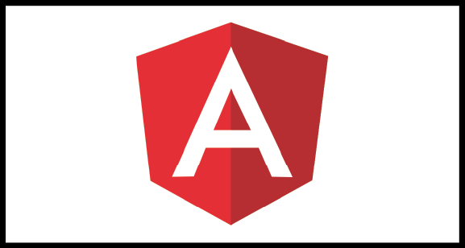
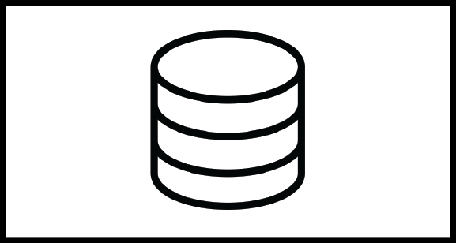

<link rel="stylesheet" href="https://pro.fontawesome.com/releases/v5.10.0/css/all.css" integrity="sha384-AYmEC3Yw5cVb3ZcuHtOA93w35dYTsvhLPVnYs9eStHfGJvOvKxVfELGroGkvsg+p" crossorigin="anonymous"/>
<h1 align="center">👋 &ltHello World /&gt 👋</h1>
<h2 align="center">Programmer && FullStack Developer && Designer </h2>
<!--  -->

- 🔭 I’m currently working on **Competitive Programming**
- 🌱 I’m currently learning **WebDesinging**
- 👯 I’m looking to collaborate on **OpenSource**
- 🤔 I’m looking for help with **DSA**
- 💬 Ask me anything about **My Skills**
- 📫 How to reach me: <a href="mailto:gploswal@gmail.com">gploswal@gmail.com</a>
- 😄 Pronouns: **ViceVersa** 🤪
- ⚡ Fun fact: **Don't fix problems fix your thinking problems will be fixed by themselves**

<h1 align="center"> Connect Me </h1>

 
    <!--  -->
    
    
    
<p]>
 

<h1 align="center"> My Skills </h1>
<!--  -->

    
    
    
    
    
    
    
    
    
<!--     
     -->

 
 

    
<!--      -->

  

